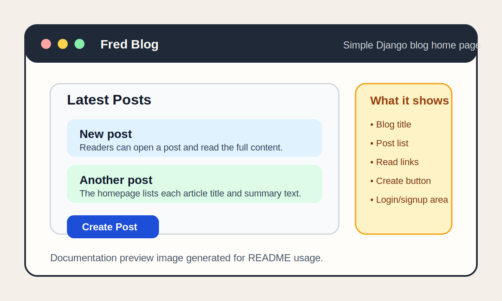
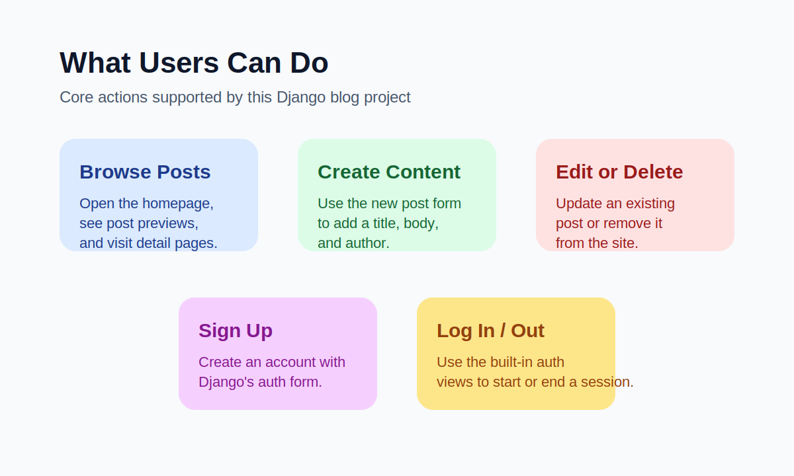

# Django Blog Website 1.0

A simple Django blog application built as a learning project for practicing class-based views, Django authentication, templates, static files, and CRUD operations.

## Project Purpose

This project demonstrates how to build a small blog website with Django. It is designed to show the core structure of a Django application, including:

- user signup and login pages
- a homepage that lists blog posts
- post detail pages
- create, update, and delete flows for posts
- static CSS styling with Django templates

## Project Images





## What Users Can Do

Users of the project can:

- view the list of blog posts on the homepage
- open an individual post to read its full content
- create a new post
- edit an existing post
- delete a post
- sign up for an account
- log in and log out with Django's built-in authentication views

## Project Structure

- `blog/`: blog post model, views, URLs, and blog tests
- `accounts/`: signup view and account-related tests
- `config/`: project settings and root URL configuration
- `templates/`: shared layout plus blog and authentication templates
- `static/`: custom CSS files
- `readme_imgs/`: README documentation images

## Tech Stack

- Python 3.11
- Django 4.2
- SQLite
- Django templates
- Django class-based generic views

## Setup

1. Create and activate a virtual environment.

```bash
python3 -m venv .venv
source .venv/bin/activate
```

2. Install the project dependencies.

```bash
pip install -r requirements.txt
```

3. Apply the database migrations.

```bash
python manage.py migrate
```

4. Start the development server.

```bash
python manage.py runserver
```

5. Open the project in your browser.

```text
http://127.0.0.1:8000/
```

## How To Test

Run the full Django test suite with:

```bash
python manage.py test
```

## Test Coverage Included

The automated tests currently cover:

- blog model behavior
- homepage and detail page responses
- post create, update, and delete flows
- signup page rendering
- signup form submission and user creation

## Notes

- The project uses SQLite by default, so no extra database setup is required for local development.
- The custom styling is loaded from `static/css/base.css`.
- The README images are stored in `readme_imgs/` and can be replaced later with real screenshots if you want.
